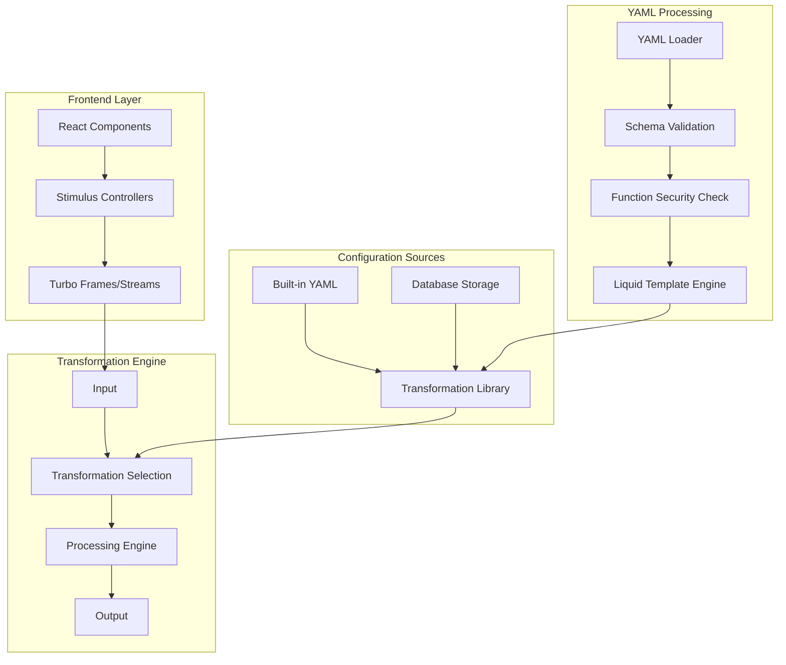
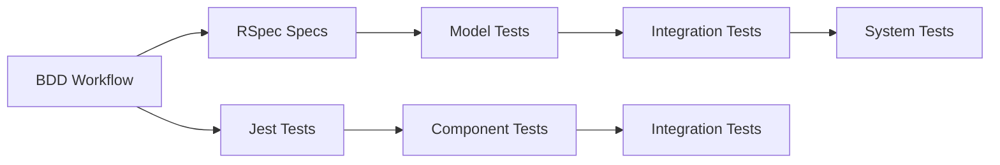

# Transformer

A modern string manipulation web application built with Ruby on Rails 8.0.2 for complex text transformations with both browser and API interfaces.

## 🏗️ Application Overview

Transformer provides a powerful, secure system for text processing including:
- **Regex replacements** for log/payload readability  
- **Base64 encoding/decoding** for strings and Kubernetes config maps
- **Named transformation persistence** with built-in YAML + database storage
- **Live editor interface** for crafting and testing transformations (planned)
- **CLI tool** for batch processing (planned)

## 🚀 Tech Stack

### Backend
- **Ruby on Rails**: 8.0.2 with modern Zeitwerk autoloading
- **Database**: SQLite with Solid adapters
- **Background Jobs**: Solid Queue
- **Caching**: Solid Cache
- **Real-time**: Solid Cable + ActionCable
- **Template Engine**: Liquid for secure YAML transformations
- **Testing**: RSpec with comprehensive coverage
- **Deployment**: Docker + Kamal

### Frontend
- **Asset Pipeline**: Propshaft + Importmap
- **JavaScript**: Stimulus + Turbo (Hotwire)
- **React**: Modern JS/TS components (planned)
- **Styling**: CSS with modern approaches
- **Testing**: Jest (when configured)

### Architecture


## 🛠️ Development Setup

### Prerequisites
- Ruby 3.2+
- Node.js 18+
- Docker (optional)

### Local Development
```bash
# Clone and setup
git clone <repository>
cd transformer
bin/setup

# Run development server
bin/dev

# Run tests
bundle exec rspec          # Backend tests
npm test                   # Frontend tests (when configured)
```

### Docker Development
```bash
# Build and run
docker build -t transformer .
docker run -p 3000:3000 transformer
```

## 🚀 Current Features

### ✅ Core Transformation Engine
- **Modular Architecture**: Each transformation type as separate, composable module
- **Interface-based Design**: Common `Transformable` contract for all transformations
- **Built-in Transformations**: Regex replacement, Base64 encode/decode
- **Validation Framework**: Comprehensive input validation and error handling

### ✅ YAML Configuration System
- **Liquid Template Engine**: Secure templating with function whitelisting
- **Schema Validation**: Comprehensive YAML structure validation
- **Multi-step Transformations**: Chain multiple transformations sequentially
- **File-based Discovery**: Auto-load transformations from `config/transformations/`

### ✅ Advanced Features
- **Line Range Filtering**: Target specific sections of input using start/stop patterns
- **Function Security**: Whitelisted function calls prevent code injection
- **Sample Library**: Real-world transformation examples including K8s Secret decoding

## 📁 Project Structure

### Core Components
```
app/
├── controllers/         # Rails controllers
├── models/             # ActiveRecord models & transformation engine
│   ├── concerns/       # Transformable interface
│   ├── transformations/ # Built-in transformation classes
│   │   ├── base64_decode.rb
│   │   ├── base64_encode.rb
│   │   └── regex_replace.rb
│   ├── yaml_transformations/    # YAML-based transformation system
│   │   ├── base.rb
│   │   ├── composite_transformation.rb
│   │   ├── function_based_transformation.rb
│   │   └── ...
│   ├── yaml_transformation_loader.rb # YAML file processing
│   └── yaml_function_registry.rb    # Security function whitelist
├── views/              # ERB templates
├── javascript/         # Stimulus + React components
│   ├── controllers/    # Stimulus controllers
│   └── __tests__/      # Jest test setup
├── jobs/               # Background jobs
└── services/           # Business logic services (planned)

config/transformations/          # Sample YAML transformations
├── k8s_secret_decoder.yml      # Kubernetes Secret base64 decoder
├── log_timestamp_normalizer.yml # ISO timestamp converter
└── log_level_highlighter.yml   # Log level emoji highlighter

spec/                   # RSpec test files
├── models/             # Model and engine specs
├── support/            # Test helpers and matchers
└── factories/          # Test data factories
```

## 🧪 Testing Strategy



### Backend Testing (RSpec)
```bash
# Run all tests
bundle exec rspec

# Run with documentation format
bundle exec rspec --format documentation

# Run specific test file
bundle exec rspec spec/models/sample_yaml_transformations_spec.rb
```

### Current Test Coverage
- **75+ test examples** across transformation engine, YAML system, and sample transformations
- **100% passing tests** with comprehensive edge case coverage
- **Security validation** tests for function whitelisting and input sanitization

### Sample Transformations

#### K8s Secret Decoder
```yaml
name: "k8s_secret_decoder"
description: "Decode base64 secrets from Kubernetes Secret data section"
version: "1.0"

transformations:
  - type: "function_based"
    config:
      template: |
        {{ input 
           | split_lines 
           | map_values(base64_decode) 
           | join_lines }}
      
      allowed_functions:
        - split_lines
        - map_values
        - base64_decode
        - join_lines
      
      line_range:
        start_pattern: "^data:"
        stop_pattern: "^(metadata|spec|status|kind):"
        include_boundaries: false
```

#### Log Processing
```yaml
# ISO timestamp normalizer
transformations:
  - type: "regex_replace"
    config:
      pattern: '(\d{4}-\d{2}-\d{2})T(\d{2}:\d{2}:\d{2})\.?\d*Z?'
      replacement: '\1 \2'

# Log level highlighter with emoji
transformations:
  - type: "regex_replace"
    config:
      pattern: '(?i)\b(ERROR|FATAL)\b'
      replacement: '🔴 [\1]'
```

## 🔒 Security Features

### Function Whitelisting
- **Principle**: Only pre-approved Ruby methods can be called from YAML
- **Implementation**: Whitelist maintained in Ruby code, not YAML configuration
- **Validation**: Function calls validated at parse time and runtime

### Template Safety
- **Liquid Engine**: Safe variable interpolation without arbitrary code execution
- **Input Sanitization**: All inputs validated before template processing
- **Error Handling**: Clear, secure error messages for invalid configurations

## 🚢 Deployment

This application is configured for deployment using:
- **Kamal**: Modern Rails deployment
- **Docker**: Containerized deployment
- **Thruster**: HTTP caching and compression

## 📋 Project Status

See [goals.md](./goals.md) for detailed project tracking and current priorities.

**Current Epic**: Core Data Model & Transformations  
**Recently Completed**: Story 2.5 - Sample YAML Transformations & K8s ConfigMap with line_range filtering  
**Next Steps**: Story 2.6 - Transformation Validation & Tooling

## 📚 Documentation

- **[YAML Schemas](docs/yaml-schemas.md)**: Complete transformation configuration reference
- **[Goals Tracker](goals.md)**: Project roadmap and development progress
- **[Copilot Instructions](.github/copilot-instructions.md)**: Development workflow guidance

## 🎯 Next Steps

### Planned Features
- **REST API**: Transformation endpoints for programmatic access
- **Live Editor Interface**: Browser-based transformation playground with real-time preview
- **Pipeline Orchestration**: Chain multiple transformations with conditional logic
- **CLI Tool**: Command-line interface for batch processing

## 🤝 Contributing

1. Follow BDD approach: tests first, then implementation
2. Update goals.md with intended changes
3. Maintain documentation currency
4. Use conventional commit messages

### License
This project is licensed under the Mozilla Public License 2.0 (MPL-2.0). See the [LICENSE](LICENSE) file for details.