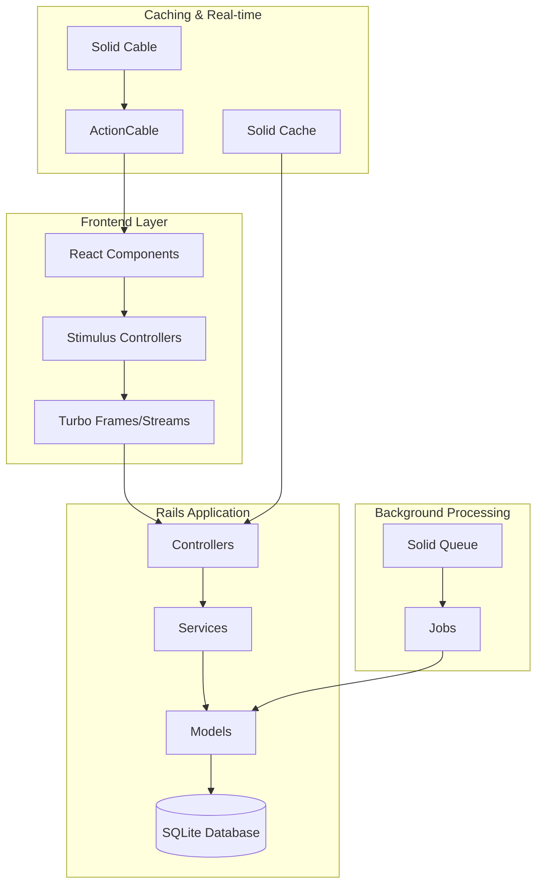
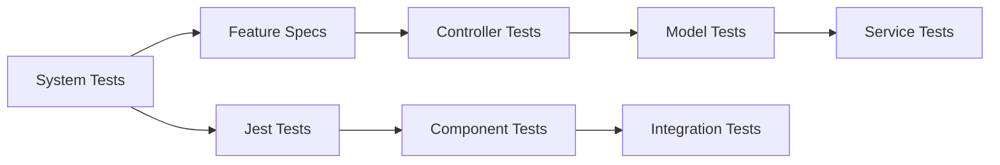

# Transformer

A modern Ruby on Rails 8.0.2 application with React integration for building scalable web applications.

## 🏗️ Architecture Overview



## 🚀 Tech Stack

### Backend
- **Ruby on Rails**: 8.0.2 (latest features)
- **Database**: SQLite with Solid adapters
- **Background Jobs**: Solid Queue
- **Caching**: Solid Cache
- **Real-time**: Solid Cable + ActionCable
- **Deployment**: Docker + Kamal

### Frontend
- **Asset Pipeline**: Propshaft + Importmap
- **JavaScript**: Stimulus + Turbo (Hotwire)
- **React**: Modern JS/TS components
- **Styling**: CSS with modern approaches

### Testing & Quality
- **Backend Testing**: RSpec
- **Frontend Testing**: Jest
- **Code Quality**: RuboCop (Rails Omakase), Brakeman
- **Development**: Debug gem, hot reloading

## 🛠️ Development Setup

### Prerequisites
- Ruby 3.2+
- Node.js 18+
- Docker (optional)

### Local Development
```bash
# Clone and setup
git clone <repository>
cd transformer
bin/setup

# Run development server
bin/dev

# Run tests
bin/rspec                 # Backend tests
npm test                  # Frontend tests (when configured)
```

### Docker Development
```bash
# Build and run
docker build -t transformer .
docker run -p 3000:3000 transformer
```

## 📋 Project Status

See [goals.md](./goals.md) for detailed project tracking and current priorities.

**Current Epic**: Project Foundation & Setup
**Next Steps**: Configure testing frameworks and define application requirements

## 🧪 Testing Strategy



### Backend Testing (RSpec)
- **Models**: Unit tests for business logic
- **Controllers**: API endpoint testing
- **Services**: Business logic isolation
- **Features**: End-to-end user flows

### Frontend Testing (Jest)
- **Components**: React component behavior
- **Integration**: Component interaction
- **E2E**: Critical user paths

## 📁 Project Structure

```
app/
├── controllers/         # Rails controllers
├── models/             # ActiveRecord models
├── views/              # ERB templates
├── javascript/         # Stimulus + React components
│   ├── controllers/    # Stimulus controllers
│   └── components/     # React components (TBD)
├── jobs/               # Background jobs
└── services/           # Business logic services (TBD)

config/
├── routes.rb           # Application routes
├── database.yml        # Database configuration
└── importmap.rb        # JavaScript imports

test/                   # Test files
├── models/
├── controllers/
├── system/
└── __tests__/          # Jest tests (TBD)
```

## 🚢 Deployment

This application is configured for deployment using:
- **Kamal**: Modern Rails deployment
- **Docker**: Containerized deployment
- **Thruster**: HTTP caching and compression

## 🤝 Contributing

1. Follow BDD approach: tests first, then implementation
2. Update goals.md with intended changes
3. Maintain documentation currency
4. Use conventional commit messages

## 📚 Documentation

- **[Goals & Tracker](./goals.md)**: Project progress and planning
- **[Copilot Instructions](./.github/copilot-instructions.md)**: Development workflow guidance

---

*Built with ❤️ using Ruby on Rails 8.0.2 and modern web technologies*
