# Commit Validation System Documentation

## Overview

The commit validation system provides automated analysis of git changes to ensure code quality, goal alignment, and conventional commit message generation. It follows a service-oriented architecture with clear separation of concerns.

## Architecture Overview


## Service Architecture

### 1. CommitReviewer (Orchestrator)

The central orchestrator that coordinates all analysis services:

```ruby
class CommitReviewer
  def analyze_changes
    changes = @git_analyzer.get_worktree_diff
    goal_analysis = @goal_analyzer.check_alignment(changes)
    quality_analysis = @code_analyzer.review_changes(changes)
    
    ReviewResult.new(...)
  end
end
```

**Responsibilities:**
- Orchestrate analysis workflow
- Aggregate results from all analyzers
- Build final ReviewResult with recommendations

### 2. GitAnalyzer (Git Interface)

Extracts and parses git diff information:


**Decision Logic:**
- Combines staged and unstaged changes for complete analysis
- Parses diff format to extract file changes and content
- Creates typed GitChange objects with helper methods (`ruby_file?`, `test_file?`, etc.)

### 3. GoalAnalyzer (Goal Alignment)

Checks if changes align with current project goals:


**Decision Process:**

1. **Current Story Detection:**
   ```ruby
   # Finds: ### Story 1.5: Title\n**Status**: 🔄 In Progress
   current_match = content.match(/### (Story \d+\.\d+: .+?)\n\*\*Status\*\*: 🔄 In Progress/m)
   ```

2. **Context Extraction:**
   - **Keywords**: `**bold**` and `code` snippets from story description
   - **Technologies**: rake, git, rspec, yaml based on content analysis
   - **File Areas**: lib/tasks, spec, app/services based on story context

3. **Alignment Check:**
   ```ruby
   def check_files_align_with_story(file_patterns, story_context)
     changed_areas = file_patterns[:directories]
     expected_areas = story_context[:file_areas]
     (changed_areas & expected_areas).any?
   end
   ```

### 4. CodeQualityAnalyzer (Quality Checks)

Performs static analysis on code changes:


**Quality Checks Performed:**

1. **Ruby Pattern Analysis:**
   ```ruby
   # Long methods (>120 chars)
   issues << "❌ Long method detected" if content.length > 120
   
   # TODO comments
   issues << "❌ TODO comment found" if content.include?('TODO')
   
   # Hardcoded strings (>50 chars)
   issues << "❌ Hardcoded string" if content.match?(/["'][^"']{50,}["']/)
   ```

2. **Zeitwerk Compliance:**
   ```ruby
   # Class name must match filename
   class_name = content.match(/class\s+(\w+)/)[1]
   expected_file = class_name.underscore + '.rb'
   actual_file = File.basename(file)
   
   unless actual_file == expected_file
     issues << "❌ Zeitwerk violation: #{class_name} should be in #{expected_file}"
   end
   ```

3. **Namespace Validation:**
   - Checks for missing module declarations in nested paths
   - Validates directory structure matches namespace hierarchy

### 5. CommitMessageGenerator (Message Creation)

Generates conventional commit messages based on changes and context:


**Message Generation Logic:**

1. **Type Determination:**
   ```ruby
   return 'feat' if files.any? { |f| f.start_with?('app/') && !f.include?('spec/') }
   return 'test' if files.all? { |f| f.include?('spec/') }
   return 'docs' if files.all? { |f| f.end_with?('.md') }
   return 'chore' if files.any? { |f| f.start_with?('lib/tasks/') }
   ```

2. **Scope Detection:**
   ```ruby
   return 'validation' if files.any? { |f| f.include?('commit') }
   return 'yaml' if files.any? { |f| f.include?('transformations') }
   ```

3. **Description Generation:**
   - If current story exists: Extract purpose from story title
   - Otherwise: Generate based on file changes and primary action

## Data Flow

### Review Process Flow


### Message Generation Flow


## Decision Trees

### File Type Classification


### Quality Issue Severity

```mermaid
graph TB
    A[Code Issue] --> B{Type?}
    
    B -->|Zeitwerk Violation| C[❌ CRITICAL]
    B -->|Missing Namespace| C
    B -->|Security Issue| C
    
    B -->|Long Method| D[⚠️ WARNING]
    B -->|Hardcoded String| D
    B -->|Hard Tabs| D
    
    B -->|TODO Comment| E[💡 SUGGESTION]
    B -->|Potential Refactor| E
    B -->|Missing Tests| E
    
    C --> F[Block Commit]
    D --> G[Warn Developer]
    E --> H[Suggest Improvement]
```



## Configuration and Customization

### Thresholds and Constants

```ruby
# CodeQualityAnalyzer
LONG_METHOD_THRESHOLD = 120
HARDCODED_STRING_MIN_LENGTH = 50
MAX_METHODS_PER_CLASS = 10

# File Type Detection
RUBY_EXTENSIONS = ['.rb']
YAML_EXTENSIONS = ['.yml', '.yaml']
DOC_EXTENSIONS = ['.md']

# Zeitwerk Patterns
NAMESPACE_MODULES = %w[App Models Services Controllers]
```

### Extending the System

The system is designed for extensibility:

1. **New Analyzers**: Implement the analyzer interface and add to CommitReviewer
2. **Custom Quality Checks**: Add methods to CodeQualityAnalyzer
3. **Additional File Types**: Extend GitChange helper methods
4. **New Commit Types**: Update CommitMessageGenerator type detection

## Error Handling and Edge Cases

### Git Analysis Edge Cases

- **Empty repository**: Returns empty changes array
- **Binary files**: Skipped in diff parsing
- **Merge conflicts**: Conflict markers treated as content
- **Large files**: No size limits currently imposed

### Goal Analysis Edge Cases

- **Missing goals.md**: Returns "no story found"
- **Malformed YAML frontmatter**: Graceful degradation
- **Multiple in-progress stories**: Takes first match
- **No story context**: Defaults to permissive alignment

### Quality Analysis Edge Cases

- **Non-UTF8 files**: Ruby string handling manages encoding
- **Generated files**: No special handling currently
- **Vendored code**: Analyzed like application code

## Performance Considerations

### Optimization Strategies

1. **Lazy Loading**: Services instantiated only when needed
2. **Minimal File Reading**: goals.md read once per analysis
3. **Efficient Parsing**: Single-pass diff parsing
4. **Caching Potential**: Results could be cached by git SHA

### Scalability Limits

- **Large diffs**: Linear time complexity O(n) where n = diff lines
- **Complex regexes**: Some quality checks use expensive patterns
- **File system calls**: Multiple file existence checks

## Testing Strategy

The system uses comprehensive RSpec testing:


## Future Enhancements

### Planned Improvements

1. **Configurable Rules**: YAML-based quality rule configuration
2. **Plugin Architecture**: External analyzer plugins
3. **IDE Integration**: VS Code extension for real-time feedback
4. **CI/CD Integration**: Git hooks and GitHub Actions
5. **Metrics Dashboard**: Historical code quality trends
6. **AI Integration**: LLM-powered code review suggestions

### Architectural Extensions


---

## Conclusion

The commit validation system provides a robust, extensible foundation for maintaining code quality and project alignment. Its service-oriented architecture allows for easy testing, maintenance, and future enhancements while providing immediate value through automated analysis and conventional commit generation.

The system successfully implements the three core requirements:
1. **Goal Alignment**: Ensures changes match current project stories
2. **Code Quality**: Automated detection of common issues and anti-patterns  
3. **Commit Generation**: Conventional commits following best practices

This documentation serves as both an architectural reference and a guide for future development and maintenance of the system.
